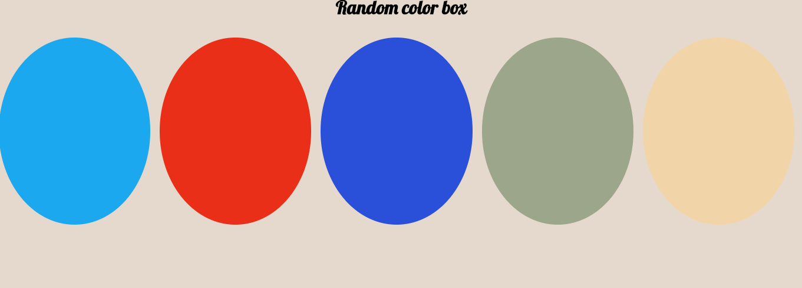
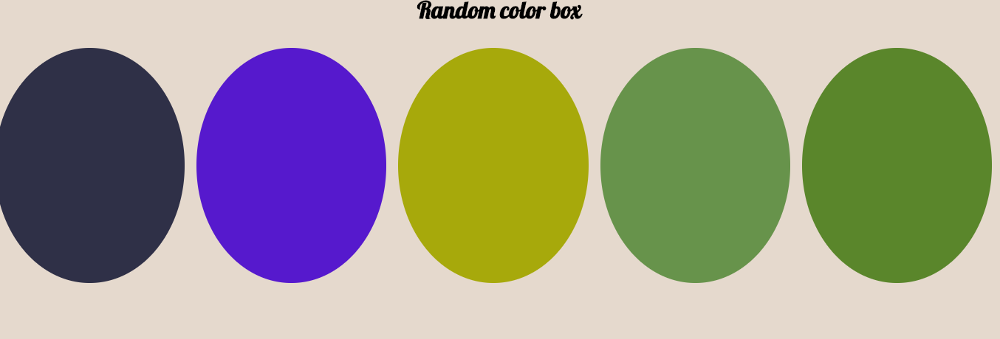
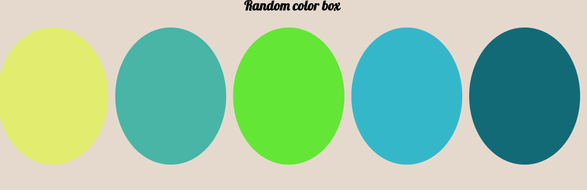

# Random color circle

## Objetivo
Crear a través de la librería React una plataforma que muestre varios círculos de colores y cuando se recarge la página los colores cambien.

## Herramientas
 * React
 * ES6
 * Babel
 * Codepen

## Flujo
1. Se crea cinco círculos que contendran diversos colores.

2. A cada circulo se le asigna un color en el esquema hexadecimal `#9999ee`

3. Para obtner el color se implementa la función random para generar los colores de manera aleatoria ` Math.random()`.

 Ejemplo:

 ```javascript
 Math.random() = 0.46112227249186244
 ```
4. El número generado se procede a convertirlo al sistema hexadecimal.

  Ejemplo:

  ```javascript
  0.46112227249186244.toString(16)= 0.760c1bf7cf4bc

  ```
5. Luego se recorta el resultado para obtener los seis dígitos del esquema del color hexadecimal.

 Ejemplo:

 ```javascript
 0.46112227249186244.toString(16).slice(-6) = 7cf4bc
 ```
6. Y de esta manera se genera los colores para cada círculo y cada vez que se recarga la página cambian los colores.

## Resultado
1. Primer resultado

   

2. Segundo resultado: Al recargar la página el resultado es

   

3. Tercer Resultado

   

## Otros
* [Codepen](https://codepen.io/melissayauri/pen/rJbRyg)
